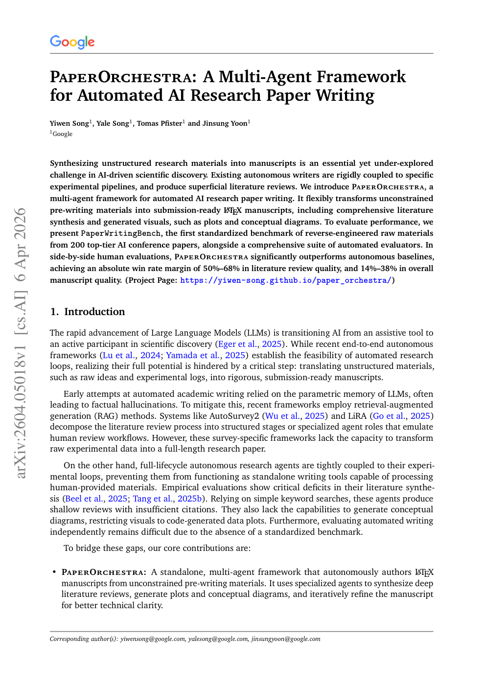

# paper-orchestra

A pluggable skill pack that lets **any coding agent** in Claude Code, Cursor,
Antigravity, Cline, Aider, OpenCode, etc. which can run the
[**PaperOrchestra**](https://arxiv.org/pdf/2604.05018) multi-agent pipeline for
turning unstructured research materials into a submission-ready LaTeX paper.

> Song, Y., Song, Y., Pfister, T., Yoon, J.
> *PaperOrchestra: A Multi-Agent Framework for Automated AI Research Paper Writing.*
> arXiv:2604.05018, 2026. <https://arxiv.org/pdf/2604.05018>

<p align="center">
  <a href="https://arxiv.org/pdf/2604.05018">
    
  </a>
  <br/>
  <em>Click to read the paper on arXiv</em>
</p>

## Why this exists

The paper defines a five-agent pipeline 
- Outline
- Plotting
- Literature Review
- Section Writing
- Content Refinement
  
that substantially outperforms single-agent and tree-search baselines on the `PaperWritingBench` benchmark (50–68% absolute win margin on literature review quality; 14–38% on overall quality). The paper ships the exact prompts for every agent in Appendix F.

This repo turns those prompts, schemas, halt rules, and verification pipelines into a set of **host-agent-executable skills**. There are **no API keys**, no SDK dependencies, no embedded LLM calls. The skills are instruction documents plus deterministic helpers; your coding agent does all LLM reasoning and web search using its own tools.


## How skills work here

Each skill is:

- `SKILL.md` — a dense instruction document the host agent reads and follows.
- `references/` — reference material: verbatim paper prompts (Appendix F), JSON
  schemas, rubrics, halt rules, example outputs.
- `scripts/` — **purely deterministic** local helpers: JSON schema validation,
  Levenshtein fuzzy matching, BibTeX formatting, dedup, LaTeX sanity checks,
  coverage gates. No network, no LLM, no API keys.

Everything else (LLM reasoning, web search, Semantic Scholar lookups, LaTeX compilation) is **delegated to the host agent** by instruction. See [`skills/paper-orchestra/references/host-integration.md`](skills/paper-orchestra/references/host-integration.md) for per-host invocation (Claude Code, Cursor, Antigravity, Cline, Aider).


## The seven skills

| Skill | Paper step | # LLM calls | Role |
|---|---|---|---|
| `paper-orchestra` | orchestrator | — | Top-level driver. Coordinates the other six. |
| `outline-agent` | Step 1 | 1 | Idea + log + template + guidelines → structured outline JSON (plotting plan, lit review plan, section plan). |
| `plotting-agent` | Step 2 | ~20–30 | Execute plotting plan; render plots & conceptual diagrams; optional VLM-critique refinement loop; caption everything. |
| `literature-review-agent` | Step 3 | ~20–30 | Web-search candidates; Semantic Scholar verify (Levenshtein > 70, cutoff, dedup); draft Intro + Related Work with ≥90% citation integration. |
| `section-writing-agent` | Step 4 | 1 | One single multimodal call: draft remaining sections, build tables from experimental log, splice figures. |
| `content-refinement-agent` | Step 5 | ~5–7 | Simulated peer review; accept/revert per strict halt rules; safety constraints prevent gaming the evaluator. |
| `paper-writing-bench` | §3 | — | Reverse-engineer raw materials (Sparse/Dense idea, experimental log) from an existing paper to build benchmark cases. |
| `paper-autoraters` | App. F.3 | — | Run the paper's own autoraters: Citation F1 (P0/P1), LitReview quality (6-axis), SxS paper quality, SxS litreview quality. |

Steps 2 and 3 run in parallel (see `skills/paper-orchestra/references/pipeline.md`).

## Install

```bash
git clone <this repo> ~/paper-orchestra
cd ~/paper-orchestra
pip install -r requirements.txt   # deterministic helpers only
```

Then symlink the skills you want into your host's skill directory:

```bash
# Claude Code
mkdir -p ~/.claude/skills
for s in paper-orchestra outline-agent plotting-agent literature-review-agent \
         section-writing-agent content-refinement-agent paper-writing-bench \
         paper-autoraters; do
  ln -sf ~/paper-orchestra/skills/$s ~/.claude/skills/$s
done

# Or for ~/.all-skills/
mkdir -p ~/.all-skills
for s in paper-orchestra outline-agent plotting-agent literature-review-agent \
         section-writing-agent content-refinement-agent paper-writing-bench \
         paper-autoraters; do
  ln -sf ~/paper-orchestra/skills/$s ~/.all-skills/$s
done
```

For Cursor / Antigravity / Cline / Aider, see `skills/paper-orchestra/references/host-integration.md`.

## Optional integrations

The pipeline requires **zero API keys to run** under any host with a native
web search tool.  Two optional integrations improve throughput or coverage:

- **[Semantic Scholar API key](https://api.semanticscholar.org/)** — Phase 2
  (citation verification) uses the public unauthenticated Semantic Scholar
  endpoint by default (≤1 QPS).  A free API key raises the rate limit and
  reduces 429 back-off during large runs.  The bundled
  `scripts/s2_search.py` reads `SEMANTIC_SCHOLAR_API_KEY` from the
  environment automatically — if the variable is absent it silently falls
  back to unauthenticated mode.  The repo never commits a key.

  ```bash
  export SEMANTIC_SCHOLAR_API_KEY="your-key-here"   # https://api.semanticscholar.org/
  # verify it's picked up:
  python skills/literature-review-agent/scripts/s2_search.py --check-key
  ```

  See `skills/literature-review-agent/references/s2-api-cookbook.md` for
  endpoint details, field reference, and error-handling notes.

- **[PaperBanana](https://github.com/dwzhu-pku/PaperBanana)** (Zhu et al.,
  2026) — the figure-generation backbone used by PaperOrchestra for Step 2.
  Runs a Retriever → Planner → Stylist → Visualizer → Critic loop that
  produces publication-quality diagrams grounded in real paper examples.
  Requires a **free [Gemini API key](https://aistudio.google.com/)**.

  ```bash
  git clone https://github.com/dwzhu-pku/PaperBanana
  cd PaperBanana
  pip install -r requirements.txt
  cp configs/model_config.template.yaml configs/model_config.yaml
  # open model_config.yaml and paste your Gemini key into api_keys.google_api_key
  export PAPERBANANA_PATH="/path/to/PaperBanana"
  ```

  That's it. Set `PAPERBANANA_PATH` and the plotting-agent uses PaperBanana
  automatically for diagram figures; falls back to matplotlib if unset.
  See `skills/plotting-agent/references/paperbanana-cookbook.md` for details.

- **[Exa](https://exa.ai)** — research-paper-focused search engine. The
  literature-review-agent can use it as a Phase 1 candidate-discovery
  backend via `skills/literature-review-agent/scripts/exa_search.py`. Set
  `EXA_API_KEY` in your environment (the repo never commits a key) and the
  helper queries Exa with `category: "research paper"`, returning 10–20
  candidates per query in the format the rest of the pipeline expects. See
  `skills/literature-review-agent/references/exa-search-cookbook.md` for
  the full recipe, query patterns, cost (~$0.007/query), and security
  notes.

  ```bash
  export EXA_API_KEY="your-key-here"   # https://dashboard.exa.ai/
  python skills/literature-review-agent/scripts/exa_search.py \
      --query "Sparse attention long context" --num-results 15
  ```

  Skip Exa entirely if your host (Claude Code, Cursor, Antigravity) already
  has a native web search tool — the agent will use that instead.

## Quickstart

```bash
# 1. scaffold a workspace next to your raw materials
python skills/paper-orchestra/scripts/init_workspace.py --out workspace/

# 2. drop your inputs into workspace/inputs/
#    (idea.md, experimental_log.md, template.tex, conference_guidelines.md;
#     optional pre-existing figures go in workspace/inputs/figures/)

# 3. ask your coding agent:
#    "Run the paper-orchestra pipeline on ./workspace"
```

A ready-to-run toy case lives at `examples/minimal/`.

## Repo layout

```
paper-orchestra/
├── README.md, LICENSE, CITATION.cff, requirements.txt
├── skills/                  # 7 skills + orchestrator
├── examples/minimal/        # toy end-to-end example
└── docs/
    ├── architecture.md      # deep-dive on the pipeline
    ├── paper-fidelity.md    # design-decision → paper page map
    └── coding-agent-integration.md  # per-host setup
```

## Fidelity to the paper

Every agent prompt in `skills/*/references/prompt.md` is reproduced **verbatim** from Appendix F of arXiv:2604.05018, with a header pointing to the page number. See `docs/paper-fidelity.md` for a design-decision → paper-page map.

On top of the paper, this repo adds a few deterministic hardening scripts (orphan-citation gate, anti-leakage grep, worklog-based rollback, provenance snapshots). These are clearly marked as out-of-paper improvements in `docs/paper-fidelity.md`.

## Citation

If you use this skill pack, please cite the PaperOrchestra paper. If you use
the PaperBanana plotting backbone, cite that too:

```bibtex
@article{song2026paperorchestra,
  title={{PaperOrchestra}: A Multi-Agent Framework for Automated {AI} Research Paper Writing},
  author={Song, Yiwen and Song, Yale and Pfister, Tomas and Yoon, Jinsung},
  journal={arXiv preprint arXiv:2604.05018},
  year={2026},
  url={https://arxiv.org/abs/2604.05018}
}

@article{zhu2026paperbanana,
  title={{PaperBanana}: Automating Academic Illustration for {AI} Scientists},
  author={Zhu, Dawei and Meng, Rui and Song, Yale and Wei, Xiyu and Li, Sujian and Pfister, Tomas and Yoon, Jinsung},
  journal={arXiv preprint arXiv:2601.23265},
  year={2026},
  url={https://arxiv.org/abs/2601.23265}
}
```


```
It would have been fun if the repo wrote the paper.

```

## License

MIT — see `LICENSE`.
